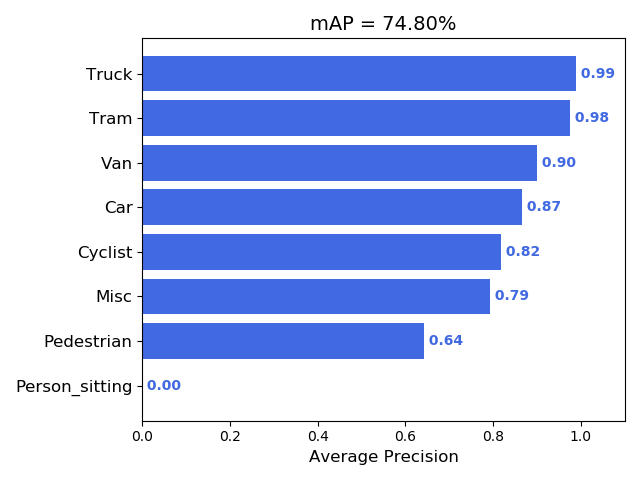

Moblienet_SSD on KITTI object detection dataset
===================================================

This project has been done in a standard training way. The SSD detector architecture is reproduced based on the paper [SSD: Single Shot MultiBox Detector](https://arxiv.org/abs/1512.02325). 
MobilenetV2 is used as the backbone of the detector. In order to verify the feasibility of the new built SSD detector, we test the model in VOC2007 dataset with an input 300*300 and achieved 74% mAP on the testset, which is equivalent to the results from paper.
As for the training on the KITTI dataset, the SSD detector is adjusted for an input size 160*480 and the new priors are proposed by the way of clustering the size of the bounding boxes from the test datasets. Finally, we achieved 74.8% mAP of 8 classes on the testset ($\approx$ 480/7480 frames). 

Run steps：

1. Convert kitti format dataset to VOC format:
    `python3 preparation/kitti2voc.py` 

2. Manually splitting the dataset for trainval, test
     
3. Translating VOC xml annotations to txt annotations

    `python3 preparation/voc2txt_annotation.py` 
    
4. Training the SSDBody

    `python3 Trainer/Train.py` 
    
5. Finding the training models in the `logs/`
    
6. Evaluation on the testset

7. Run the detection on Kitti raw videos

    Download the [raw Kitti data](http://www.cvlibs.net/datasets/kitti/raw_data.php) 
    python3 demo/video.py


2D Object Detection Benchmark Overview (from KITTI)
===================================================

The goal in the 2D object detection task is to train object detectors for the
classes 'Car', 'Pedestrian', and 'Cyclist'. The object detectors must
provide as output the 2D 0-based bounding box in the image using the format
specified above, as well as a detection score, indicating the confidence
in the detection. As evaluation criterion we follow
PASCAL and require the intersection-over-union of bounding boxes to be
larger than 50% for an object to be detected correctly.

```

Validation Results ( 480 test images, 700 valid images, 6100 train images)


SSD Mobilenet
===========================
Category          mAP@0.5IOU
car               0.8666
cyclist           0.8182
misc              0.7931
pedestrian        0.6419
person_sitting    0.0000
tram              0.9754
truck             0.9883
van               0.9004
Total             0.7480
Total(no sitting) 0.8549


Final Total Loss
================
ssd     2.048  approximately 50 hours  RTX 2080ti

```

SSD Evaluation Results
===================================================

<p align="center">
    


Video test
===================================================

